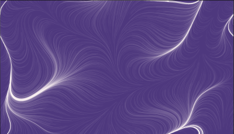

# Flow Fields
> This project was made after watching @Chris-Courses [video](https://www.youtube.com/watch?v=na7LuZsW2UM) on the subject of flow fields.
> Live demo [_here_](https://the-kob.github.io/FlowField_HazySnow/).

## Features
- Random generation of perlin noise to ensure a different pattern every load.

## Screenshots

<!-- If you have screenshots you'd like to share, include them here. -->

## Setup
Just download the project and run it in your browser. I used the Live Server extension from VSCode.

You can always access it [here](https://the-kob.github.io/FlowField_HazySnow/).

## Usage
For now, just reload the webpage.

## Project Status
Project is still in progress since I'll be looking into adding a simple GUI to change the colors and the seed.
I'm also planning to make the field move.

## Acknowledgements
- As I said before, this project was inspired by the video on flow fields by @Chris-Courses.
- Special thanks to Diogo Fona for helping me figure out some of the math involved.
